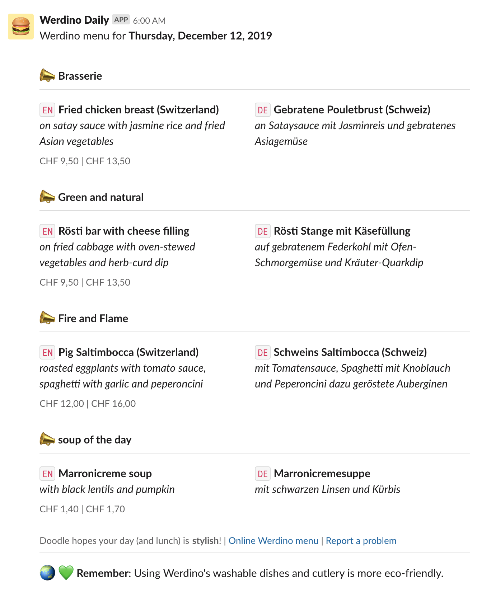

# Werdino Daily

:pizza: :hamburger: 

> The [Werdino daily menu](https://clients.eurest.ch/de/tamediazuerich/menu) in English and German, delivered straight to Slack via AWS Lambda

:trophy:

> _"Werdino Daily is the most important Slack Integration of the 21st century"_   
~ Chuck Norris, Inventor of Slack, the Internet and the 21st century



## Serverless

> :bulb: The main Lambda function is found in `handler.js`

> :bulb: All the serverless configs can be found in serverless.yml

### Getting Started

1. Make sure you have the Serverless framework installed globally: `npm install -g serverless`
2. Use the `SLACK_WEBHOOK_ADDRESS` keys in `config/config.dev.json` and `config/config.prod.json` for the `dev` and `prod` deployments
3. Download and save your Google API credential file and save it with the filename of `google-cloud-creds.json` at the root of this directory. Make sure the credentials in the file are allowed to access the Google Translate API.

### Deploy to AWS Lambda

Serverless will do a lot of magic with the `deploy` command, including wrapping your function in a `.zip` directory and uploading to S3 (and uploaded to AWS Lambda), configuring CloudWatch, configuring IAM, etc:

```
$ serverless deploy --stage dev
$ serverless deploy --stage prod
```

### Reading the Logs

```
$ serverless logs --function runWerdino --tail
```

### Deploy the Function Locally for Testing

:bulb: Running locally will apply the `dev` stage by default
```
SLS_DEBUG=* serverless invoke local --function runWerdino
```


